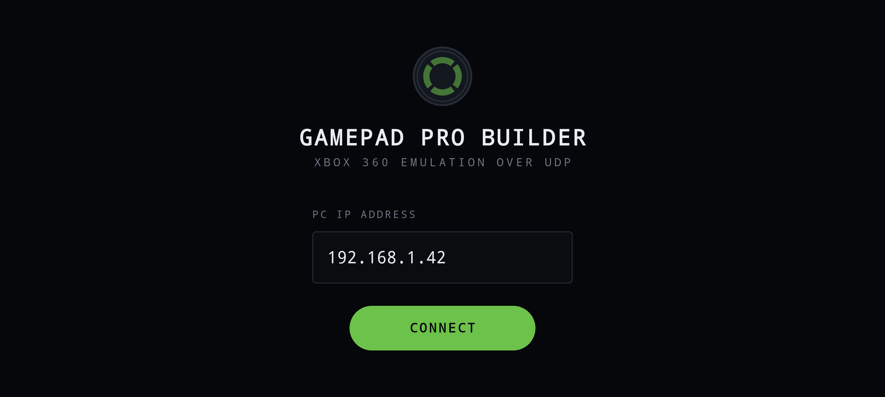
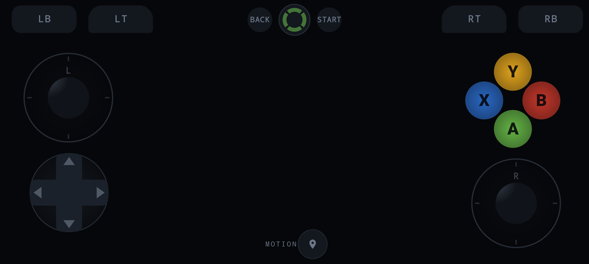

# Phone as Controller — Xbox 360 Emulation

> ⚠️ **Early / raw version.** This is a working prototype, not a polished release. It does
> the job, but expect rough edges: no connection validation, no configuration UI beyond the
> layout editor, Windows-only server, unsigned debug builds, and the known issues listed
> [below](#known-issues). Use it, break it, report what fails.

Turn an Android phone into a virtual Xbox 360 gamepad for your PC. The phone sends
button and stick state over UDP; a small Python server on the PC feeds that state into
the ViGEmBus driver, which exposes a real Xbox 360 controller to Windows. Games see an
ordinary gamepad — no per-game configuration needed.

<p align="center">
  
  
</p>

## Components

| Part | Location | Role |
| --- | --- | --- |
| Android client | [app/](app/) | Jetpack Compose gamepad UI, sends UDP packets |
| PC server | [server.py](server.py) | Receives UDP packets, drives a virtual Xbox 360 controller |

## Features

- **Xbox 360 layout and vocabulary** — A/B/X/Y, LB/RB, LT/RT, Back/Start, all named and
  mapped the way the emulated controller actually reports them
- **Customizable layout** — drag any control to reposition it, tap one to select it, then
  resize, reassign, or delete it in Edit mode; **+** adds an extra button
- **Persistent settings** — layout and last-used IP are saved with DataStore
- Two analog sticks (with an angle indicator on the rim), D-Pad, four face buttons,
  shoulder buttons, digital LT/RT triggers, Back/Guide/Start
- **Motion mode** — tilt the phone to drive the left stick (accelerometer)
- Immersive fullscreen — the status and navigation bars are hidden during play
- State is sent every 15 ms (~66 Hz)

## Requirements

- **PC:** Windows, Python 3.8+, [ViGEmBus driver](https://github.com/ViGEm/ViGEmBus/releases)
- **Phone:** Android 8.0+ (minSdk 26), accelerometer
- Both devices on the same network (same Wi-Fi, or a VPN such as Radmin/Hamachi)
- To build from source: Android Studio, JDK 17, compileSdk 35

## Setup

### 1. Start the server on the PC

Install the ViGEmBus driver first, then:

```bash
pip install vgamepad
python server.py
```

The server prints your PC's IP address and starts listening on UDP port `5005`:

```
========================================
   GAMEPAD SERVER: PRO EDITION
========================================
[OK] Virtual Xbox 360 kontrolleri yaratildi.
[OK] Server ishga tushdi.
[!] Kompyuter IP manzili: 192.168.1.42     <-- you need this
[!] Port: 5005
```

If Windows Firewall asks for permission, allow Python on private networks — otherwise the
packets never reach the server.

### 2. Install the app on the phone

Build and install over ADB:

```bash
./gradlew installDebug
```

Or open the project in Android Studio and hit Run. A prebuilt debug APK ends up at
`app/build/outputs/apk/debug/app-debug.apk` (not committed to this repo).

### 3. Connect the client

1. Open the app — it starts on the **Gamepad Pro Builder** screen.
2. Type the IP address the server printed into the **PC IP** field (port is not needed —
   it is always 5005). The last IP you used is restored automatically next time.
3. Tap **CONNECT**. The gamepad screen appears and the phone immediately starts streaming
   input.
4. The server console confirms it with `[OK] Telefon ulandi: <phone-ip>`.

The transport is UDP, so there is no handshake — the app only validates that the address
is resolvable. If you enter a *valid but wrong* IP, the app will still show the gamepad
screen while nothing reaches the PC. Always check for the `Telefon ulandi` line in the
server console.

### 4. Customize the layout (optional)

On the gamepad screen:

- **Ring-of-light (Guide) button**, top centre — tap it to enter Edit mode. Tap any control
  to select it (a green outline appears), then use the slider to resize it, the dropdown to
  reassign what it sends, or 🗑 to delete it. **+** adds a new button. **SAVE** stores the
  layout and exits Edit mode. Back, Start, and the analog sticks/D-Pad/face buttons keep
  their fixed function; only extra buttons you add are reassignable.
- **MOTION toggle**, bottom centre — turns on motion mode (green = on). The left stick is
  then driven by tilting the phone instead of by touch.

## Protocol

Each packet is 8 bytes, big-endian, struct format `>HBBBBBB`:

```
[buttons: uint16][LX][LY][RX][RY][LT][RT]
```

Stick and trigger bytes are `0..255` with `128` as the neutral center. Button bits are
defined once in [Protocol.kt](app/src/main/java/com/example/controller/Protocol.kt) and
must match `MAP` in [server.py](server.py#L45-L58) exactly:

| Bit | Button | Bit | Button |
| --- | --- | --- | --- |
| `0x0001` | A | `0x0100` | LB |
| `0x0002` | B | `0x0200` | RB |
| `0x0008` | X | `0x1000` | D-Pad Up |
| `0x0010` | Y | `0x2000` | D-Pad Down |
| `0x0040` | Back | `0x4000` | D-Pad Left |
| `0x0080` | Start | `0x8000` | D-Pad Right |

There is no bit for the Guide button — vgamepad's virtual XUSB report doesn't expose one
(real Xbox 360 pads handle it out-of-band too), so in the app that button opens the local
layout editor instead of sending anything over the wire.

Port: `5005/udp`.

## Known issues

- **No real connection check.** UDP has no handshake, and the app only verifies that the IP
  resolves. A valid-but-wrong address still opens the gamepad screen.
- **Digital triggers only.** LT/RT send `0` or `255`, never an intermediate value.
- **No L3/R3 (stick clicks) or Guide input.** The wire protocol only carries the ten bits
  `server.py` maps to `vgamepad`; there's no thumbstick-click or Guide bit to send.
- **Windows-only server.** `vgamepad`/ViGEmBus does not exist on Linux or macOS.
- **No release signing config**, so `assembleRelease` produces an unsigned APK.
- **Saved layouts don't carry forward.** The on-screen layout moved from absolute
  coordinates to screen-fraction based ones, under a new DataStore key — a layout saved
  with an older build of the app is ignored and the new default loads instead.

## Troubleshooting

| Symptom | Cause |
| --- | --- |
| `[XATO] ViGEmBus drayveri topilmadi` | The ViGEmBus driver is not installed — install it and reboot |
| Toast "Invalid address" on the phone | The IP could not be resolved — check for typos |
| Gamepad screen opens but nothing happens on the PC | Wrong IP, blocked by the firewall, or the devices are on different networks |
| Server never prints `Telefon ulandi` | No packets arriving — same causes as above |
| Game does not see the controller | Start the server *before* launching the game |
